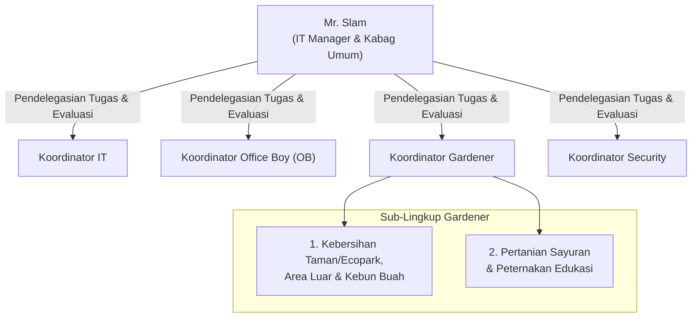
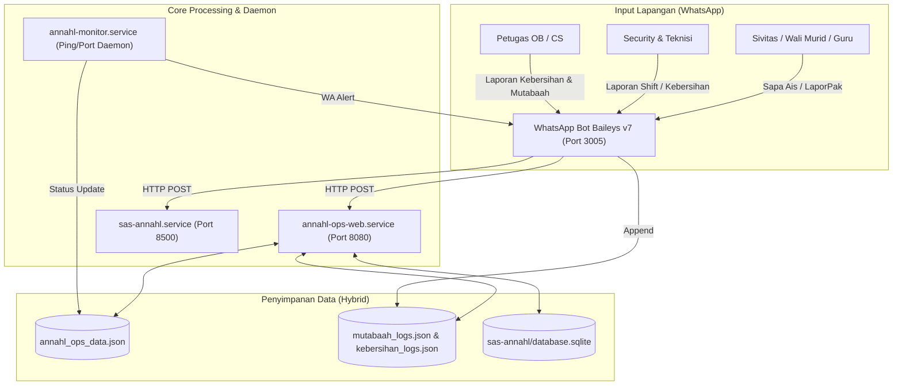
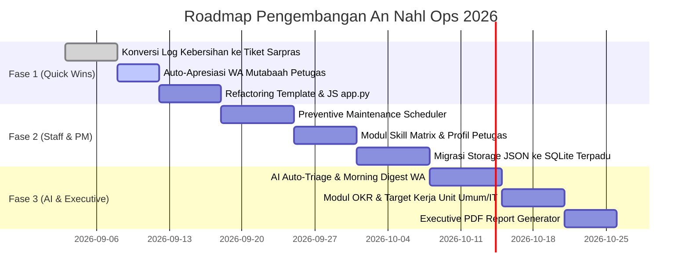

# CETAK BIRU & RENCANA STRATEGIS PENGEMBANGAN AN NAHL OPS
**Versi:** 1.0 (September 2026)  
**Penyusun:** AI Executive Architect, Senior Software Engineer & Operational Leader  
**Stakeholder Utama:** Mr. Slam (IT Manager & Kabag Umum Sekolah Islam An Nahl)  
**Dokumen Induk:** [`/home/ametriyadhi/AGENTS.md`](file:///home/ametriyadhi/AGENTS.md)

---

## 1. PENDAHULUAN & VISI STRATEGIS

Aplikasi **An Nahl Ops** (`https://note-umum.ametriyadhi.com`) adalah pusat komando operasional (*Operational Command Center*) yang mengintegrasikan dua pilar kepemimpinan Mr. Slam:
1. **Pilar Personal Leadership**: Manajemen fokus kerja, pencatatan jurnal harian, to-do list, dan evaluasi mutabaah diri (peningkatan kualitas diri & spiritual).
2. **Pilar Organizational Operations**: Pemantauan kesiapan sarana prasarana sekolah, kebersihan area, keandalan server/infrastruktur IT, pemeliharaan fasilitas (*general affairs*), dan pembinaan harian petugas lapangan (OB, Security, Teknisi).

### Visi Transformasi
> *"Mentransformasi An Nahl Ops dari sekadar aplikasi pencatatan log & pemantau pasif menjadi **Enterprise Operations & People Development Engine** yang mendorong perkembangan spiritual-karakter petugas lapangan, menjamin operasional preventif tanpa kendala (*zero downtime*), serta mengukur ketercapaian program kerja tahunan secara akuntabel."*

---

## 2. STRUKTUR ORGANISASI & LINGKUP 4 KOORDINATOR KERJA

Secara hierarkis, operasional di bawah komando **Mr. Slam (IT Manager & Kabag Umum)** mengoordinasikan 4 unit kerja lapangan utama, masing-masing dipimpin oleh seorang **Koordinator Unit**:



### Rincian Lingkup Kerja Koordinator:

| Unit Kerja | Koordinator | Sub-Lingkup & Fokus Operasional | Output Kunci Harian |
| :--- | :--- | :--- | :--- |
| **1. IT** | Koordinator IT | • Jaringan & Internet Kampus (Wi-Fi, Switch, Router).<br>• Server & CBT/Lab Komputer.<br>• Sound System / AV Kelas & Ruang Rapat.<br>• Sistem Informasi Sekolah (SPMB, Web, SAS). | • Status server & jaringan 100% online.<br>• Tiket komplain IT terselesaikan cepat. |
| **2. Office Boy** | Koordinator OB | • Kebersihan indoor (Ruang Kelas, Toilet, Koridor Gedung).<br>• Kebersihan Kantor Manajemen & Ruang Guru.<br>• Logistik harian & kebutuhan konsumsi rapat.<br>• Pengelolaan tempat sampah & sanitasi dalam gedung. | • Checklist audit kebersihan toilet & kelas.<br>• Rekap mutabaah yaumiyah anggota OB. |
| **3. Gardener** | Koordinator Gardener | **Sub-Lingkup A (Lanskap & Ecopark)**:<br>• Kebersihan taman, rumput, dan area luar gedung.<br>• Perawatan kebun buah & estetika pepohonan.<br><br>**Sub-Lingkup B (Agro & Peternakan)**:<br>• Budidaya & perawatan sayuran (kebun/hidroponik).<br>• Pemberian pakan & sanitasi kandang hewan ternak. | • Jadwal siram/potong rumput terealisasi.<br>• Logbook pakan ternak & panen sayuran.<br>• Area outdoor bersih dari sampah kering/basah. |
| **4. Security** | Koordinator Security | • Pengamanan gerbang utama, perimeter, & pos jaga.<br>• Manajemen lalu lintas drop-off & pick-up siswa.<br>• Patroli malam/siang dan pencegahan insiden.<br>• Buku tamu & identifikasi pengunjung/tamu asing. | • Logbook shift & patroli 24 jam.<br>• Laporan insiden nihil (*zero incident*). |

---

## 3. TRANSFORMASI SISTEM: DARI PRIBADI KE MENU KOLABORASI KOORDINATOR

Sistem To-Do dan Jurnal Kegiatan yang awalnya khusus catatan pribadi pimpinan ditransformasi menjadi **Engine Kolaborasi & Pendelegasian Tim**:

1. **Alur Pendelegasian (Delegation Workflow)**:
   - **Mr. Slam** membuat tugas baru di dashboard $\rightarrow$ memilih unit tujuan (`IT`, `OB`, `GARDENER`, `SECURITY`) dan Koordinator PIC.
   - Koordinator menerima notifikasi pendelegasian (via dashboard & WA Bot).
   - Koordinator memperbarui progres (`Belum Mulai` $\rightarrow$ `Sedang Dikerjakan` $\rightarrow$ `Menunggu Verifikasi` $\rightarrow$ `Selesai`) dengan melampirkan foto hasil/catatan output.
   - **Mr. Slam** melakukan verifikasi hasil (*Sign-off*) dan memberikan feedback evaluasi.

2. **Jurnal Kegiatan Koordinator (Daily Operational Rhythm)**:
   - Masing-masing koordinator wajib mengisi jurnal aktivitas tim harian (briefing pagi, pekerjaan prioritas yang dieksekusi, serta kendala lapangan).
   - Pimpinan dapat memantau jurnal ke-4 unit dalam satu layar konsolidasi (*Helicopter View*).

3. **Sistem Autentikasi Terpadu (Login & Session Security)**:
   - Akses publik ditiadakan untuk menu operasional; seluruh pengguna wajib login melalui halaman otentikasi `/login`.
   - Menggunakan Flask Session yang aman (*persistent secret key*) dan proteksi password hashing berstandar industri (`werkzeug.security`).
   - Sesi login otomatis mendeteksi role pengguna dan hanya memuat data serta tab yang sesuai dengan hak aksesnya.

4. **Menu Manajemen User (User Management Panel)**:
   - Menu khusus bagi **Manager (Mr. Slam)** di sidebar navigasi untuk mengelola akun:
     - **Daftar Pengguna**: Menampilkan Username, Nama Lengkap, Unit Kerja, Role, No. WhatsApp, Status Aktif, dan Riwayat Login.
     - **Tambah Pengguna**: Form pembuatan akun koordinator baru dengan penugasan unit kerja dan sub-lingkup spesifik.
     - **Edit & Reset Password**: Fitur ubah profil, ganti password, atau reset instan jika koordinator lupa sandi.
     - **Status Akun**: Toggle aktif/nonaktif akun jika terjadi rotasi atau pergantian personel koordinator.

5. **Menu Manajemen Role & Hak Akses (RBAC Permission Matrix)**:
   - Menu konfigurasi hak akses granular untuk menentukan fitur apa saja yang dapat dilihat (*view*) dan diubah (*edit/action*) oleh masing-masing peran:
     - `Role: Manager (Mr. Slam)`: Akses penuh 100% (Create, Delegate, Edit, Verify, Evaluasi, User & Role Management).
     - `Role: Koordinator IT`: Akses input/edit to-do IT, jurnal IT, monitor server/host, dan evaluasi tim IT.
     - `Role: Koordinator OB`: Akses to-do OB, jurnal OB, audit kebersihan indoor, rekap mutabaah OB, dan evaluasi tim OB.
     - `Role: Koordinator Gardener`: Akses to-do Gardener (Taman/Ecopark + Sayuran/Ternak), log kebersihan outdoor, jurnal harian, dan evaluasi tim Gardener.
     - `Role: Koordinator Security`: Akses to-do Security, buku mutasi/jurnal jaga, rekap mutabaah security, dan evaluasi tim Security.

6. **Self-Evaluation Engine (Evaluasi Mandiri Kinerja Koordinator)**:
   - Masing-masing koordinator memiliki tab khusus **"Evaluasi Kinerja Tim"** untuk berkaca secara mandiri:
     - **Task SLA Score**: % tugas pendelegasian yang selesai tepat waktu.
     - **Journal Discipline**: Konsistensi pengisian jurnal harian tim kerja.
     - **Team Mutabaah Rate**: Tingkat kedisiplinan ibadah anggota timnya.
     - **Zone Health Index**: Tingkat kepuasan & ketiadaan komplain di areanya.

---

## 4. AUDIT KONDISI EKSISTING & GAP ANALYSIS



### A. Keunggulan Sistem Saat Ini (Strengths)
1. **Praktis & Terbukti di Lapangan**: Digunakan secara aktif setiap hari oleh puluhan petugas OB dan staf untuk setor mutabaah yaumiyah dan foto kebersihan.
2. **Low-Friction via WhatsApp**: Petugas tidak perlu menginstal aplikasi baru; interaksi langsung melalui WhatsApp Bot Baileys v7.
3. **Resilient Local-First**: Bekerja stabil di jaringan lokal dengan fallback loopback API (`127.0.0.1:8080`, `127.0.0.1:8500`, `127.0.0.1:3005`).

### B. Temuan Gap & Keterbatasan (Areas for Improvement)
1. **Technical Debt Arsitektur (`app.py` 3.776 Baris)**:
   - Monolitik: Rute Flask, template HTML string, CSS overrides, dan >1.000 baris vanilla JavaScript bercampur dalam satu file.
   - Sulit dirawat secara modular dan berisiko tinggi saat menambah fitur baru.
2. **Risiko Konkurensi Flat-File JSON**:
   - Data aktif operasional (`annahl_ops_data.json`, `mutabaah_logs.json`, `kebersihan_logs.json`) disimpan dalam JSON biasa tanpa transaksi ACID atau relational integrity, rentan race-condition saat multi-threading.
3. **Putusnya Siklus Tindak Lanjut (*Disconnected Operational Loop*)**:
   - Temuan kerusakan fasilitas di laporan kebersihan (misal: *"kolem renang: shower kecil & gantungan baju kurang"*) hanya berhenti sebagai baris log teks, belum terhubung otomatis menjadi tiket pekerjaan teknisi dengan SLA penyelesaian.
4. **Mutabaah Belum Mengembangkan Manusia (*Human Growth Gap*)**:
   - Data mutabaah ibadah baru berfungsi sebagai rekapitulasi administratif, belum ada umpan balik, apresiasi personal berkala, maupun sistem pembinaan karakter bagi petugas.
5. **Operasional Masih Bersifat Reaktif**:
   - Belum memiliki modul *Preventive Maintenance (PM)* terjadwal (misal: cuci AC berkala, kuras toren, uji pompa air, pengecekan APAR).

---

## 5. EMPAT PILAR STRATEGIS PENGEMBANGAN

```
┌─────────────────────────────────────────────────────────────────────────┐
│               AN NAHL OPS: ENTERPRISE OPERATIONS ENGINE                 │
├────────────────────┬────────────────────┬───────────────────────────────┤
│ 1. PEOPLE GROWTH   │ 2. OPERATIONAL     │ 3. SYSTEM & AI                │
│    & SPIRITUAL     │    EXCELLENCE      │    INTELLIGENCE               │
│ • Yaumiyah Habit   │ • Closed-Loop      │ • AI Auto-Triage & Digest     │
│ • Star Performer   │   Ticket Engine    │ • Predictive Maintenance      │
│ • Skill Matrix     │ • Preventive       │ • Unified SQLite DB           │
│ • 1-on-1 Coaching  │   Maintenance (PM) │ • Modular Blueprint           │
│                    │ • Area Audit Score │   Architecture                │
├────────────────────┴────────────────────┴───────────────────────────────┤
│                   4. EXECUTIVE STRATEGY & KPI MONITOR                   │
│ • OKR Ketercapaian Program Unit Umum & IT                               │
│ • Executive Briefing Yayasan / Direktur (PDF Otomatis)                  │
└─────────────────────────────────────────────────────────────────────────┘
```

---

### PILAR 1: PERKEMBANGAN & PEMBINAAN PETUGAS (PEOPLE & SPIRITUAL GROWTH)
*Tujuan: Membangun budaya kerja amanah, profesional, dan menumbuhkan rasa kepemilikan (sense of belonging) bagi seluruh petugas lapangan.*

1. **Habit Tracker & Indeks Istiqomah Ibadah**:
   - Menghitung persentase kepatuhan dan konsistensi mutabaah yaumiyah mingguan/bulanan (Sholat 5 Waktu, Tilawah, Dzikir).
   - Tampilan visual tren konsistensi per individu petugas di panel dashboard.
2. **Auto-Apresiasi Positif via WhatsApp Bot**:
   - Tiap Jumat/Ahad, bot mengirimkan pesan apresiasi personal secara otomatis kepada petugas yang istiqomah:
     > *"Jazakallahu khairan Akh Aji Kurnia! Pekan ini antum tercatat 100% konsisten menjaga Sholat 5 Waktu dan Tilawah. Semoga berkah dan menjadi teladan bagi rekan-rekan."*
3. **Pengakuan Prestasi ("Petugas Teladan Pekan Ini")**:
   - Badge pengakuan di dashboard ops bagi petugas dengan tingkat kedisiplinan dan respon kebersihan tertinggi.
4. **Skill Matrix & Catatan Pelatihan Petugas**:
   - Database keahlian khusus tiap petugas (AC, kelistrikan, plumbing, audio-visual, pertukangan, pertamanan, IT dasar).
   - Riwayat keikutsertaan pelatihan SOP, K3, dan peningkatan kompetensi.
5. **Log Mentoring & 1-on-1 Coaching**:
   - Modul internal bagi Kabag Umum untuk mencatat ringkasan sesi ngobrol/coaching bulanan dengan petugas (evaluasi kendala kerja, kesehatan keluarga, dan pengembangan karir).

---

### PILAR 2: OPERASIONAL UNGGUL & PREVENTIF (OPERATIONAL EXCELLENCE)
*Tujuan: Mewujudkan lingkungan sekolah yang bersih, nyaman, aman, dan bebas gangguan fasilitas bagi sivitas akademika.*

1. **Closed-Loop Ticket Engine (Lapor $\rightarrow$ Disposisi $\rightarrow$ Eksekusi $\rightarrow$ Verifikasi Mutu)**:
   - Tambahkan tombol aksi **"Jadikan Tiket Pekerjaan"** pada tabel log kebersihan.
   - Temuan kerusakan langsung memiliki:
     - Nomor Tiket Unik (`TK-OPS-YYYYMMDD-XXX`)
     - Tingkat Prioritas (Tinggi / Sedang / Rendah)
     - PIC Teknisi yang ditugaskan
     - Target SLA penyelesaian
     - Konfirmasi foto *"Before - After"*
   - Notifikasi balik via WhatsApp ke petugas pelapor saat fasilitas sudah selesai diperbaiki.
2. **Preventive Maintenance (PM) Scheduler (Perawatan Berkala Terjadwal)**:
   - Modul jadwal pemeliharaan rutin fasilitas sekolah:
     - Cuci Filter AC seluruh gedung (tiap 60 hari)
     - Kuras Toren Air & Uji Klorin Kolam Renang (tiap pekan)
     - Pengecekan APAR & Jalur Evakuasi (tiap bulan)
     - Pembersihan Proyektor & Access Point Wi-Fi (tiap triwulan)
   - Sistem otomatis men-generate checklist to-do saat jadwal jatuh tempo tiba.
3. **Digital Area Cleanliness Audit**:
   - Form audit cepat mingguan per zona (Sentra Publik, Area KBM, dan Area Fasilitas).
   - Penilaian skor bintang 1–5 untuk mengukur standar kualitas kebersihan tiap unit sekolah.

---

### PILAR 3: REKAYASA SISTEM & EFISIENSI ARSITEKTUR (ENGINEERING EXCELLENCE)
*Tujuan: Memastikan kode bersih, modular, tangguh terhadap konkurensi, dan mudah dikembangkan oleh pengembang manapun.*

1. **Refactoring Modular Flask Blueprints**:
   - Memecah monolit `app.py` menjadi struktur terstruktur:
     ```text
     annahl-ops-web/
     ├── app.py                     # App factory & blueprint registration
     ├── config.py                  # Environment & path configuration
     ├── blueprints/
     │   ├── dashboard.py           # Dashboard utama & statistik
     │   ├── tasks.py               # Tiket pekerjaan & to-do list
     │   ├── mutabaah.py            # Mutabaah yaumiyah & personal
     │   ├── kebersihan.py          # Log kebersihan & konversi tiket
     │   ├── monitor.py             # Uptime Kuma & server stats
     │   └── reports.py             # Export Excel & cetak laporan
     ├── templates/                 # File Jinja2 HTML terpisah
     │   ├── base.html              # Layout induk & sidebar
     │   ├── tabs/                  # Partial HTML per tab
     │   └── modals/                # Modal dialogs
     └── static/
         ├── css/tailwind.min.css   # Build Tailwind CSS lokal
         └── js/                    # Modul JavaScript terpisah (app.js, tasks.js)
     ```
2. **Migrasi Penyimpanan ke SQLite Terpadu**:
   - Mengalihkan data dari JSON flat ke SQLite terpusat (`database.sqlite` / `annahl_ops.sqlite`) dengan tabel relasional:
     - `ops_tasks` (Tiket & pekerjaan terintegrasi)
     - `ops_todos` (Agenda kerja Mr. Slam)
     - `ops_journals` (Jurnal kegiatan harian)
     - `ops_pm_schedules` (Jadwal preventive maintenance)
     - `ops_petugas_skills` (Database keahlian staf)
   - Keuntungan: Transaksi ACID aman, query agregasi cepat, dan nol risiko *file corruption*.

---

### PILAR 4: SYSTEM & AI INTELLIGENCE (AI-POWERED AUTOMATION)
*Tujuan: Memanfaatkan kecerdasan buatan untuk mengotomatiskan rutinitas harian dan memberikan wawasan prediktif bagi manajemen.*

1. **AI Auto-Triage Laporan Lapangan (Vision & NLP Gemini Flash)**:
   - Otomatis menganalisis foto dan teks laporan kebersihan WhatsApp.
   - Mendeteksi tingkat urgensi:
     - Kritis (Pipa pecah, korsleting listrik, genangan air licin dekat kelas).
     - Rutin (Gantungan baju kurang, daun berserakan, kran longgar).
   - Menyarankan kategori disposisi teknisi secara otomatis.
2. **Executive Daily Digest via WhatsApp (Briefing Harian Otomatis)**:
   - Pukul **06:45 WIB**, bot WA mengirimkan briefing pagi cerdas ke WhatsApp pribadi Mr. Slam:
     - Ringkasan status server & host (Uptime Kuma).
     - Tiket fasilitas mendesak yang butuh atensi hari ini.
     - Tingkat partisipasi mutabaah petugas kemarin sore.
     - Agenda prioritas to-do hari ini.
   - Pukul **17:00 WIB**, bot mengirimkan ringkasan sore hasil pencapaian tiket yang berhasil diselesaikan hari ini.
3. **Predictive Facility Health Analysis**:
   - Mengidentifikasi titik rawan komplain (misal: jika AC Ruang Guru SD dilaporkan tidak dingin 3x dalam 1 bulan, AI menyarankan penggantian kompresor daripada terus-menerus tambah freon).

---

## 6. TAHAPAN ROADMAP IMPLEMENTASI (ACTION PLAN)



### Tabel Rincian Deliverables

| Fase | Periode | Fokus Pekerjaan | Deliverables Kunci | Indikator Keberhasilan |
| :--- | :--- | :--- | :--- | :--- |
| **FASE 1** | Minggu 1–2 | Security, Multi-Role & Core Loop | • **Sistem Login & Autentikasi** terpadu (`/login` & session).<br>• **Menu Manajemen User** (CRUD Koordinator).<br>• **Menu Manajemen Role & Hak Akses** (Permission Matrix).<br>• Pendelegasian To-Do ke 4 Koordinator.<br>• Tombol "Jadikan Tiket" pada Log Kebersihan.<br>• Pesan apresiasi WA berkala mutabaah. | Sistem aman dari akses publik; pendelegasian terstruktur per unit; zero kebocoran data antar-unit. |
| **FASE 2** | Minggu 3–5 | Staff Empowerment & Preventive Ops | • Modul PM Scheduler sarpras berkala.<br>• Halaman Skill Matrix & Profil Petugas.<br>• Self-Evaluation Dashboard per Koordinator.<br>• Migrasi JSON ke skema SQLite relasional. | Operasional beralih dari reaktif ke preventif; koordinator mandiri mengevaluasi tim. |
| **FASE 3** | Minggu 6–8 | AI Automation & Strategic Reporting | • AI Gemini Vision Auto-Triage laporan.<br>• Morning Digest briefing via WA Bot.<br>• Dashboard OKR & 1-klik cetak laporan Yayasan. | Pimpinan memiliki visibilitas data 360°; evaluasi pimpinan berbasis metrik akurat. |

---

## 7. REKOMENDASI PRIORITAS LANGKAH AWAL

Untuk memulai langkah nyata secara aman dan terstruktur, 3 item prioritas awal adalah:
1. **Pondasi Keamanan (Sistem Login & Manajemen User/Role)**:
   - Membuat skema tabel `ops_users` dan `ops_roles` di database.
   - Mengaktifkan halaman `/login`, session proteksi, dan menu Manajemen User/Role untuk Mr. Slam.
2. **Transformasi Pendelegasian To-Do ke 4 Koordinator**:
   - Menambahkan pemilihan unit kerja (`IT`, `OB`, `GARDENER - Taman/Ecopark`, `GARDENER - Sayuran/Ternak`, `SECURITY`) pada form penugasan.
3. **Fitur "Jadikan Tiket" dari Log Kebersihan**:
   - Menambahkan tombol aksi instan di tab Kebersihan untuk mengonversi temuan kerusakan sarpras menjadi tiket pekerjaan koordinator terkait.

---
*Dokumen ini tersimpan secara permanen sebagai acuan teknis dan operasional di repositori `annahl-ops-web` dan tercatat dalam Knowledge Base global `AGENTS.md`.*
