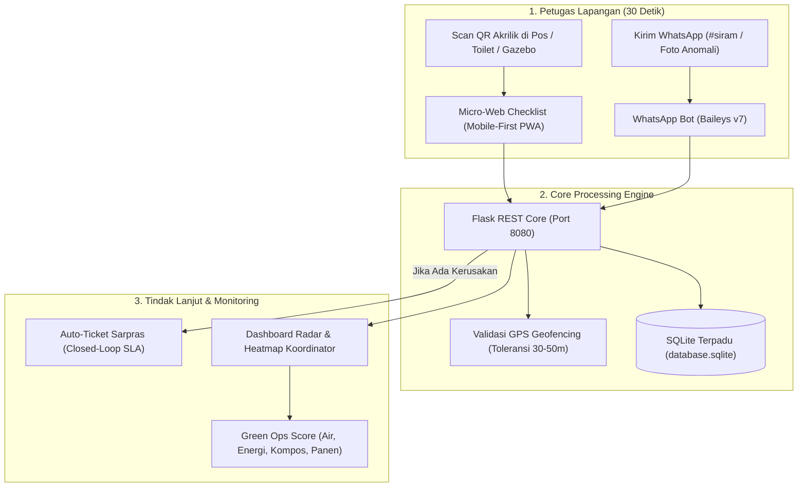
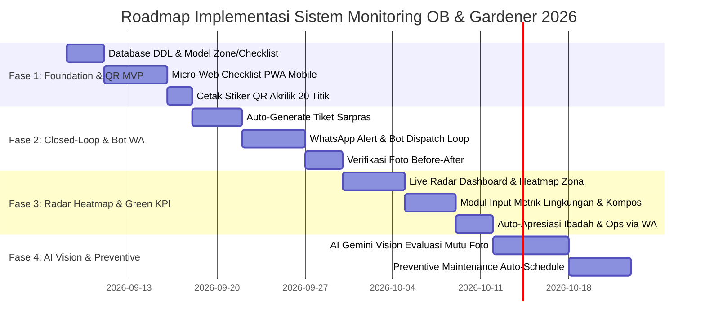

# BLUEPRINT & ACTION PLAN: SISTEM MONITORING CHECKLIST PEMELIHARAAN OB & GARDENER
## Ekosistem Operasional Ramah Lingkungan & Paperless — An Nahl Islamic School

> **Dokumen Perencanaan Teknis & Panduan Implementasi Bertahap**  
> **Target Unit:** Office Boy (OB / Indoor & Sanitasi) dan Gardener (Lanskap, Taman, Agro, Ternak Ecopark)  
> **Core Pillars:** *Low-Friction Mobile Web, Geofenced QR Akrilik, Closed-Loop Ticket Sarpras, & Green Operations Index*

---

## 1. RINGKASAN EKSEKUTIF & PRINSIP DESAIN

Sistem ini mentransformasi monitoring pemeliharaan konvensional (kertas gantung/clipboard yang rentan basah, rusak, dan dipalsukan) menjadi sistem pemantauan digital yang **cepat, akuntabel, dan 100% paperless**.



### 4 Pilar Filosofi Sistem:
1. **Low Friction (< 45 Detik per Sesi)**: Petugas tidak perlu download aplikasi PlayStore atau login rumit. Cukup scan QR dengan kamera HP biasa, checklist terbuka instan.
2. **Zero Paper & Waste**: Menghentikan pencetakan lembar checklist kertas bulanan secara total (mendukung inisiatif Adiwiyata / Eco-School).
3. **Closed-Loop Ticket Integration**: Setiap centang merah ("Rusak / Anomali") langsung menjadi tiket perbaikan ke teknisi Sarpras dengan notifikasi WhatsApp otomatis.
4. **Green Accountability**: Mengintegrasikan metrik pelestarian lingkungan (pencegahan kebocoran air, pemilahan sampah organik ke komposter, efisiensi energi listrik).

---

## 2. MATRIKS CHECKLIST PEMELIHARAAN LAPANGAN

### A. Unit Office Boy (OB / Cleaning Service — Indoor & Sanitasi)

| Shift & Waktu | Area Sasaran | Parameter Kunci Checklist | Aspek Green Ops & Konservasi |
| :--- | :--- | :--- | :--- |
| **Pagi (06:30 - 07:15)**<br>*Pre-Class Readiness* | Ruang Kelas, Koridor, Ruang Guru | 1. Lantai disapu & dipel higienis.<br>2. Meja, kursi, & papan tulis rapi/bersih.<br>3. Tempat sampah kosong & liner terpasang.<br>4. Kaca jendela & ventilasi debu bersih. | • **Hemat Energi:** Matikan lampu & AC jika ruang belum digunakan.<br>• Buka jendela untuk sirkulasi udara alami pagi. |
| **Tiga Kali Sehari**<br>*(07:30, 11:30, 15:30)* | Toilet & Wastafel Gedung | 1. Air bak/kran mengalir normal (tidak macet).<br>2. Kloset & urinal bersih, berfungsi normal.<br>3. Sabun cuci tangan & tisu tersedia.<br>4. Lantai kering (tidak licin) & cermin bersih.<br>5. Ventilasi/exhaust fan berfungsi (tidak berbau). | • **Konservasi Air Kritis:** Cek kebocoran pelampung toren & kran menetes.<br>• **Eco-Cleaning:** Gunakan larutan pembersih biodegradable (hindari HCl keras). |
| **Sore (16:30 - 17:00)**<br>*Post-Activity Closing* | Seluruh Gedung & TPS Indoor | 1. Sampah seluruh ruangan diangkut ke TPS.<br>2. Saklar lampu, AC, dan dispenser posisi OFF.<br>3. Pintu & jendela terkunci aman. | • **Pemisahan Sampah di Sumber:** Pisahkan sampah anorganik (botol/kertas) dari residu. |

---

### B. Unit Gardener (Sub-Lingkup A: Lanskap, Taman, Lapangan & Kompos)

| Shift & Waktu | Area Sasaran | Parameter Kunci Checklist | Aspek Green Ops & Konservasi |
| :--- | :--- | :--- | :--- |
| **Pagi (06:00 - 08:30)**<br>*Optimal Watering* | Taman Utama, Lapangan, Pedestrian | 1. Penyiraman tanaman tuntas sebelum jam 08:30.<br>2. Rumput & semak dipangkas rapi (berkala).<br>3. Jalur pedestrian & parit bersih dari daun/lumpur. | • **Efisiensi Air:** Siram pagi untuk minimalkan evaporasi/penguapan air.<br>• Prioritaskan air tandon hujan (*rainwater harvesting*). |
| **Siang (13:30 - 15:00)**<br>*Organic Waste Handling* | Rumah Kompos & Bank Sampah | 1. Serasah daun kering taman dikumpulkan.<br>2. Daun dicacah & dimasukkan ke bak kompos aktif.<br>3. Pengecekan aerasi & kelembaban tumpukan kompos. | • **Zero Burning Policy:** 100% daun kering diolah jadi kompos organik sekolah. Dilarang keras membakar sampah daun. |
| **Sore (16:00 - 17:00)**<br>*Evening Inspection* | Seluruh Area Luar Gedung | 1. Selang air tergulung rapi & kran utama tertutup.<br>2. Alat kerja (mesin rumput, gunting dahan) bersih & tersimpan di gudang.<br>3. Area bebas genangan air jentik nyamuk. | • **K3 Hijau & Konservasi:** Pastikan tidak ada kran taman yang menetes semalaman. |

---

### C. Unit Gardener (Sub-Lingkup B: Agro Sayuran, Buah & Ecopark Ternak)

| Shift & Waktu | Area Sasaran | Parameter Kunci Checklist | Aspek Green Ops & Konservasi |
| :--- | :--- | :--- | :--- |
| **Pagi & Sore**<br>*(07:00 & 16:00)* | Kebun Sayur Organik & Hidroponik | 1. Sirkulasi nutrisi hidroponik & PPM air normal.<br>2. Penyiraman bedengan sayur tanah terjaga.<br>3. Pengecekan hama kutu/ulat secara fisik.<br>4. Pencatatan hasil panen sayuran siap konsumsi. | • **Pestisida Nabati & Pupuk Organik:** Gunakan pupuk cair urin kelinci/kompos fermentasi. |
| **Pagi & Sore**<br>*(07:30 & 15:30)* | Ecopark (Kandang Kelinci, Kambing, Ayam, Burung, Kolam Ikan) | 1. Pemberian pakan bernutrisi & air minum segar.<br>2. Pembersihan kotoran & sanitasi kandang.<br>3. Pengecekan sirkulasi air kolam & aerator.<br>4. Observasi kesehatan hewan (aktif & nafsu makan baik). | • **Ekonomi Sirkular:** Kotoran hewan dikumpulkan untuk bahan baku pupuk kompos padat/cair. Sisa pakan dialirkan ke maggot BSF. |

---

## 3. ARSITEKTUR BASIS DATA RELASIONAL

Sistem menggunakan SQLite terpadu (`sas-annahl/database.sqlite` / `annahl_ops.sqlite`) dengan rancangan skema tabel berikut:

```sql
-- 1. Master Master Data Zona & Pos Pemeliharaan
CREATE TABLE IF NOT EXISTS maintenance_zones (
    id VARCHAR(32) PRIMARY KEY,          -- Contoh: 'ZONE-OB-TOILET-SD-L1', 'ZONE-GAR-TAMAN-DEPAN'
    unit_type VARCHAR(16) NOT NULL,      -- 'OB' atau 'GARDENER'
    sub_scope VARCHAR(32) NOT NULL,      -- 'INDOOR_SANITASI', 'TAMAN_LANSKAP', 'AGRO_TERNAK'
    zone_name VARCHAR(100) NOT NULL,     -- Contoh: 'Toilet Siswa Gedung SD Lt 1'
    building_or_sector VARCHAR(50),      -- 'Gedung SD', 'Ecopark', 'Gedung SMP', 'Sentra Publik'
    target_lat DECIMAL(10, 8) NOT NULL,  -- Titik koordinat GPS lintang
    target_lng DECIMAL(11, 8) NOT NULL,  -- Titik koordinat GPS bujur
    geofence_radius_m INTEGER DEFAULT 40,-- Radius toleransi scan (meter)
    qr_token VARCHAR(64) UNIQUE NOT NULL,-- Token unik URL QR akrilik
    is_active BOOLEAN DEFAULT 1,
    created_at DATETIME DEFAULT CURRENT_TIMESTAMP
);

-- 2. Master Template Parameter Checklist
CREATE TABLE IF NOT EXISTS checklist_templates (
    id INTEGER PRIMARY KEY AUTOINCREMENT,
    unit_type VARCHAR(16) NOT NULL,      -- 'OB' atau 'GARDENER'
    sub_scope VARCHAR(32) NOT NULL,      -- 'INDOOR_SANITASI', 'TAMAN_LANSKAP', 'AGRO_TERNAK'
    shift_code VARCHAR(16) NOT NULL,     -- 'PAGI', 'SIANG', 'SORE', 'ALL_DAY'
    item_order INTEGER DEFAULT 1,
    item_label VARCHAR(150) NOT NULL,    -- 'Kran air & kloset tidak bocor/menetes'
    help_text VARCHAR(255),              -- 'Periksa dinding bak dan selang fleksibel'
    is_eco_critical BOOLEAN DEFAULT 0,   -- 1 = Parameter berdampak langsung pada konservasi air/energi
    is_active BOOLEAN DEFAULT 1
);

-- 3. Transaksi Log Checklist Lapangan
CREATE TABLE IF NOT EXISTS maintenance_checklist_logs (
    id INTEGER PRIMARY KEY AUTOINCREMENT,
    zone_id VARCHAR(32) NOT NULL,
    shift_code VARCHAR(16) NOT NULL,
    petugas_name VARCHAR(64) NOT NULL,
    petugas_wa VARCHAR(20),
    checked_at DATETIME DEFAULT CURRENT_TIMESTAMP,
    user_lat DECIMAL(10, 8),
    user_lng DECIMAL(11, 8),
    distance_meters INTEGER,
    is_within_geofence BOOLEAN DEFAULT 1,
    status_summary VARCHAR(16) NOT NULL, -- 'ALL_OK' (Hijau), 'ANOMALY' (Kuning), 'CRITICAL' (Merah)
    checklist_data_json TEXT NOT NULL,   -- Snapshot centang {'item_1': true, 'item_2': false}
    anomaly_notes TEXT,                  -- Catatan kerusakan jika ada
    photo_url TEXT,                      -- Bukti foto anomali / hasil kebersihan
    ticket_id VARCHAR(32),               -- ID Tiket Sarpras jika ter-generate
    FOREIGN KEY(zone_id) REFERENCES maintenance_zones(id)
);

-- 4. Transaksi Closed-Loop Tiket Perbaikan Sarpras
CREATE TABLE IF NOT EXISTS ops_maintenance_tickets (
    ticket_id VARCHAR(32) PRIMARY KEY,   -- Contoh: 'TK-OPS-20260908-001'
    source_checklist_id INTEGER,         -- Relasi ke maintenance_checklist_logs
    zone_id VARCHAR(32) NOT NULL,
    unit_source VARCHAR(16) NOT NULL,    -- 'OB' atau 'GARDENER'
    category VARCHAR(32) NOT NULL,       -- 'PLUMBING_WATER', 'ELECTRICAL', 'FURNITURE', 'GARDEN_PEST'
    priority VARCHAR(16) DEFAULT 'MEDIUM',-- 'LOW', 'MEDIUM', 'HIGH', 'EMERGENCY'
    issue_description TEXT NOT NULL,
    photo_before_url TEXT,
    reporter_name VARCHAR(64) NOT NULL,
    assigned_tech_name VARCHAR(64),
    assigned_tech_wa VARCHAR(20),
    status VARCHAR(20) DEFAULT 'OPEN',   -- 'OPEN', 'IN_PROGRESS', 'RESOLVED', 'VERIFIED'
    resolution_notes TEXT,
    photo_after_url TEXT,
    created_at DATETIME DEFAULT CURRENT_TIMESTAMP,
    resolved_at DATETIME,
    sla_hours INTEGER DEFAULT 4,
    FOREIGN KEY(zone_id) REFERENCES maintenance_zones(id)
);

-- 5. Rekap Metrik Keberlanjutan Lingkungan (Green Ops Index)
CREATE TABLE IF NOT EXISTS green_ops_daily_metrics (
    id INTEGER PRIMARY KEY AUTOINCREMENT,
    metric_date DATE NOT NULL,
    unit_type VARCHAR(16) NOT NULL,      -- 'OB' atau 'GARDENER'
    organic_waste_kg DECIMAL(6, 2) DEFAULT 0, -- Bobot sampah daun/sayur ke komposter
    compost_harvest_kg DECIMAL(6, 2) DEFAULT 0,-- Hasil panen pupuk kompos matang
    water_leaks_prevented INTEGER DEFAULT 0,   -- Jumlah titik bocor air yang berhasil ditutup
    veggie_harvest_kg DECIMAL(6, 2) DEFAULT 0, -- Hasil panen sayur kebun edukasi
    notes TEXT,
    logged_by VARCHAR(64),
    created_at DATETIME DEFAULT CURRENT_TIMESTAMP
);
```

---

## 4. TAHAPAN PENGEMBANGAN (4-PHASE ROADMAP)



---

### FASE 1: FOUNDATION & DIGITAL MICRO-CHECKLIST MVP (Minggu 1–2)
**Fokus Utama:** Meluncurkan checklist berbasis web mobile yang sangat ringan tanpa login aplikasi, didukung penempelan stiker QR akrilik di 20 titik percontohan.

* **Task 1.1: Database Migration & Seeding:**
  - Buat tabel `maintenance_zones`, `checklist_templates`, `maintenance_checklist_logs`.
  - Input 10 titik percontohan OB (Toilet SD, SMP, SMA, Koridor Utama, Ruang Guru).
  - Input 10 titik percontohan Gardener (Taman Gerbang, Gazebo Depan, Lapangan Rumput, Ecopark Kandang Kelinci, Rumah Kompos, Kebun Sayur Hidroponik).
* **Task 1.2: Micro-Web PWA Endpoint (`/checklist/<qr_token>`):**
  - Desain UI mobile responsif mengadopsi Tailwind CSS (ringan, < 80 KB total payload).
  - Mengambil data GPS browser via `navigator.geolocation.getCurrentPosition`.
  - Pilihan nama petugas dari dropdown anggota unit yang sedang bertugas hari ini.
  - Tampilan saklar toggle switch hijau/merah untuk 3–5 indikator utama per shift.
  - Opsi unggah foto bukti cepat (terkompresi langsung di sisi browser menjadi WebP/JPEG max 200 KB).
* **Task 1.3: Cetak Stiker QR Akrilik:**
  - Menggunakan modul `/standby/print-qr` di `annahl-ops-web` untuk mencetak kartu akrilik standar A5/A6 tahan air.
  - Pasang di 20 titik lokasi percontohan.

---

### FASE 2: CLOSED-LOOP TICKET & WHATSAPP BOT ALERT (Minggu 3–4)
**Fokus Utama:** Menghubungkan anomali checklist secara instan ke tim teknisi Sarpras dan Koordinator melalui WhatsApp Bot Baileys v7.

* **Task 2.1: Closed-Loop Auto-Ticketing Engine:**
  - Jika checklist mengandung item bernilai `status: FALSE` (masalah):
    - Sistem membuat record tiket di `ops_maintenance_tickets` (`TK-OPS-YYYYMMDD-XXX`).
    - Status awal: `OPEN`, SLA otomatis (Kebocoran air = 2 jam; Perbaikan umum = 8 jam).
* **Task 2.2: Dispatch Notifikasi WhatsApp Bot:**
  - Bot WhatsApp (`mutabaah-wa-bot` port 3005) mengirim alert otomatis ke grup koordinasi Sarpras & Teknisi PIC:
    ```text
    🚨 [TIKET KERUSAKAN FASILITAS DIBUAT]
    ID: TK-OPS-20260918-002
    Area: Toilet Siswa SD Lt. 1
    Pelapor: Pak Asep (OB)
    Masalah: Kran wastafel no. 2 patah / air bocor terus
    Prioritas: TINGGI (Risiko Boros Air)
    Target SLA: 2 Jam (Selesai sebelum 11:30 WIB)
    ```
* **Task 2.3: Alur Selesai & Sign-Off via WhatsApp / Web:**
  - Teknisi dapat membalas via WA: `SELESAI TK-OPS-20260918-002 [Keterangan]` dengan melampirkan foto hasil perbaikan.
  - Status tiket otomatis berubah menjadi `RESOLVED`, dan bot mengirimkan pesan konfirmasi balik ke petugas pelapor.

---

### FASE 3: RADAR HEATMAP, GREEN METRICS & APRESIASI (Minggu 5–6)
**Fokus Utama:** Menyediakan visibilitas menyeluruh (*Helicopter View*) bagi Koordinator dan Pimpinan, menghitung metrik lingkungan, serta memberikan apresiasi kepada staf.

* **Task 3.1: Dashboard Tab "Radar Pemeliharaan & Checklist" di An Nahl Ops:**
  - Peta/Grid status keterisian checklist per lantai dan per zona outdoor.
  - Warna visual:
    - **Hijau:** Sudah dicek tepat waktu & kondisi prima.
    - **Kuning:** Belum dicek (mendekati batas akhir shift).
    - **Merah:** Ditemukan kerusakan aktif yang belum tertangani.
* **Task 3.2: Modul Pencatatan Green Operations:**
  - Form pencatatan harian koordinator Gardener:
    - Kg serasah daun yang masuk ke rumah kompos.
    - Kg pupuk kompos matang yang berhasil dipanen.
    - Kg panen sayuran hidroponik/kebun edukasi.
  - Counter otomatis: *"Estimasi Air Diselamatkan Bulan Ini: X.XXX Liter"* berdasarkan jumlah kran bocor yang berhasil diperbaiki < 2 jam.
* **Task 3.3: Engine Auto-Apresiasi WhatsApp Petugas:**
  - Mengaitkan kedisiplinan checklist dengan mutabaah ibadah yaumiyah.
  - Tiap hari Jumat pukul 16:30 WIB, bot mengirim pesan apresiasi personal kepada petugas teladan pekan ini.

---

### FASE 4: AI VISUAL AUDIT & PREVENTIVE MAINTENANCE (Minggu 7–8)
**Fokus Utama:** Memanfaatkan kecerdasan buatan untuk verifikasi mutu foto dan otomasi jadwal perawatan aset sekolah.

* **Task 4.1: AI Gemini Flash Vision Quality Audit:**
  - Sistem memeriksa foto kebersihan yang diunggah petugas menggunakan model Gemini 3.5 Flash Vision.
  - AI memverifikasi apakah foto benar-benar menunjukkan toilet/taman yang bersih, atau terdapat genangan air/sampah yang terlewat.
  - Skor kebersihan (1–100) dan ringkasan kondisi tersimpan otomatis di database.
* **Task 4.2: Preventive Maintenance (PM) Scheduler:**
  - Jadwal berkala otomatis:
    - Pengurasan toren air & pembersihan biofilter (setiap Sabtu).
    - Pemupukan & aerasi tanah lapangan rumput (setiap 14 hari).
    - Desinfeksi mendalam (*deep cleaning*) toilet (setiap akhir pekan).
  - Sistem otomatis membuat agenda tugas kepada Koordinator saat jadwal jatuh tempo.

---

## 5. DETAIL SPESIFIKASI FILE & TEKNOLOGI

| Modul / Komponen | File / Path Terkait | Teknologi | Keterangan |
| :--- | :--- | :--- | :--- |
| **Micro-Web PWA Checklist** | `/home/ametriyadhi/annahl-ops-web/templates/checklist_mobile.html`<br>`/home/ametriyadhi/annahl-ops-web/static/js/checklist_pwa.js` | HTML5, Tailwind CSS, JS Geolocation | Sangat ringan, tanpa framework berat, render cepat di smartphone petugas. |
| **Backend API Core** | `/home/ametriyadhi/annahl-ops-web/blueprints/checklist_routes.py`<br>`/home/ametriyadhi/annahl-ops-web/app.py` | Python Flask, SQLite | Endpoint: `GET /c/<token>`, `POST /api/checklist/submit`, `GET /api/checklist/radar`. |
| **Dispatch WhatsApp Bot** | `/home/ametriyadhi/mutabaah-wa-bot/checklist_dispatcher.js`<br>`/home/ametriyadhi/mutabaah-wa-bot/index.js` | Node.js, `@whiskeysockets/baileys` v7 | Kirim broadcast tiket kerusakan & terima update foto perbaikan teknisi. |
| **Dashboard Radar & Green Ops** | `/home/ametriyadhi/annahl-ops-web/templates/tabs/tab_checklist_radar.html` | Chart.js, Tailwind Grid | Panel monitoring status kebersihan gedung & metrik kompos/panen. |
| **AI Vision Verifier** | `/home/ametriyadhi/sas-annahl/sapaais_rag.py` / `ai_vision.py` | Google Gemini API (Flash) | Analisis foto kebersihan & deteksi kebocoran/anomali visual. |

---

## 6. STRATEGI IMPLEMENTASI LAPANGAN (CHANGE MANAGEMENT)

1. **Prinsip "Mempermudah, Bukan Menghakimi":**
   Petugas diedukasi bahwa sistem ini dirancang agar pekerjaan mereka terdokumentasi rapi dan komplain kerusakan yang mereka temukan segera dieksekusi oleh sarpras tanpa birokrasi berbelit.
2. **Uji Coba 1 Pekan (Tanpa Sanksi):**
   Minggu pertama difokuskan untuk adaptasi cara scan dan centang. Koordinator mendampingi langsung saat jam shift berlangsung.
3. **Penyediaan Wi-Fi Lapangan yang Andal:**
   Memastikan area toilet umum, lorong gedung, dan gazebo taman tercover jaringan Wi-Fi sekolah agar tidak menghabiskan paket data pribadi staf.
4. **Gamifikasi & Apresiasi Ramah Lingkungan:**
   Unit atau gedung dengan tingkat kebersihan terbaik dan zero komplain air bocor mendapatkan penghargaan bulanan *"Green Campus Ambassador"*.

---

*Dokumen ini merupakan panduan resmi (*living document*) untuk pengembangan modul monitoring OB & Gardener di ekosistem An Nahl Ops.*
